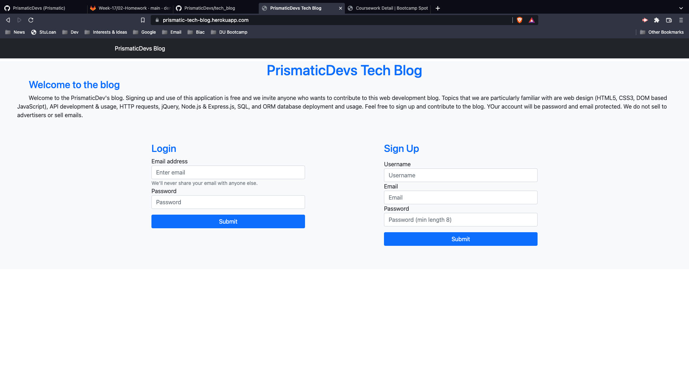
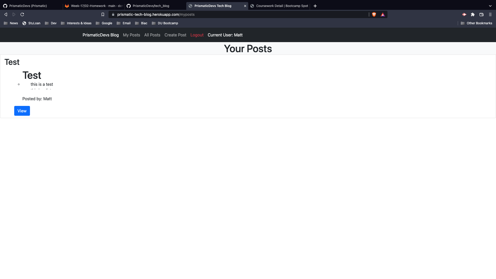
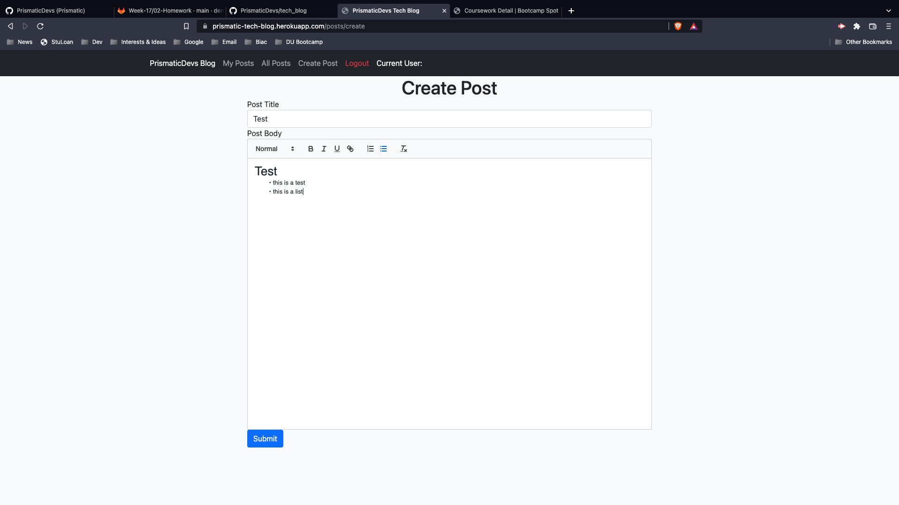
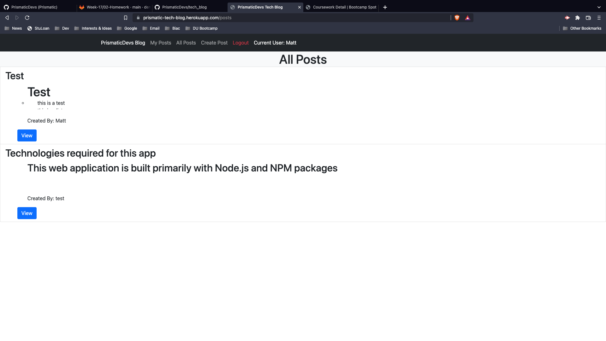
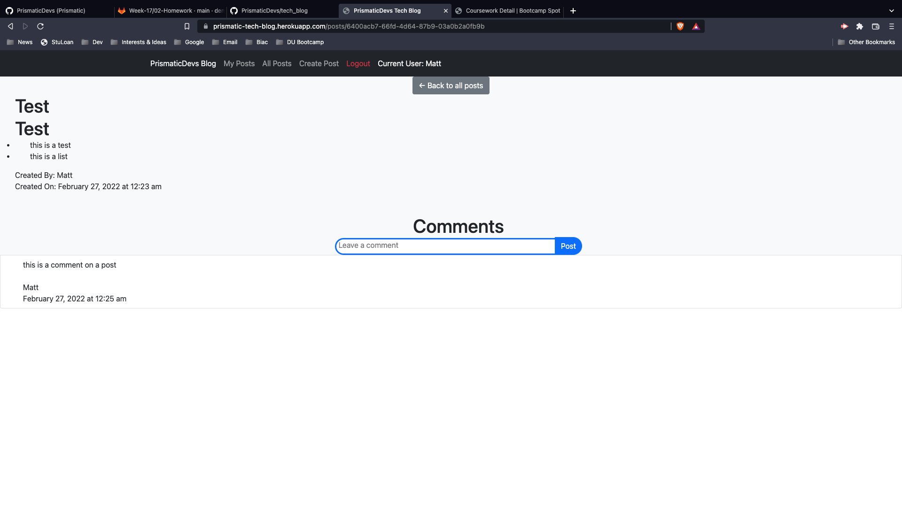

# PrismaticDevs Tech Blog

## Table of Contents

- [License](#license)
- [Description](#description)
- [Usage](#instructions)
- [Contributors](#contributors)
- [Questions](#questions)

## License

## Description

This application is a blog that allows users to register for the app, create, edit, and delete their own blog posts.

## Usage

Create an account using the registration form or if you already have an account then enter your credentials into the login form.

Then it will take you to a page where you can see all of your posts.

If you are newly registered you will want to navigate to the create post page in the navigation menu.

You can also use the navigation link for all posts.

If you see a post, click the view button to see the entire post.
You also have an option to create a comment which is saved for the posts that you comment on.

## Contributors

University of Denver

## Questions

Contact me:
Github: [PrismaticDevs](https://github.com/PrismaticDevs)  
Email: matthewbrignola@ymail.com  
Phone: 719-351-5858  
